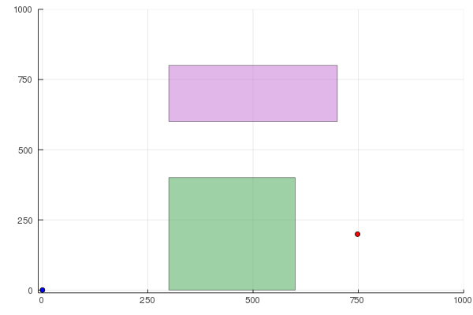
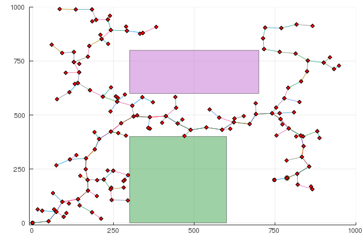

## RRT$^*$ in 2D

This folder contains an implementation of the RRT$^*$ algorithm for points in 2D. The usual functions are contained in a package `rrthp`. The file `RRT.jl` implements the RRT algorithm.

### Instructions:
* After entering the `read-eval-print loop` (REPL), setup the environment by running `include("startup.jl")`
* Execute: `include("RRT.jl")`
* You should obtain two files:
  * Setup: 
  * Solution: 
